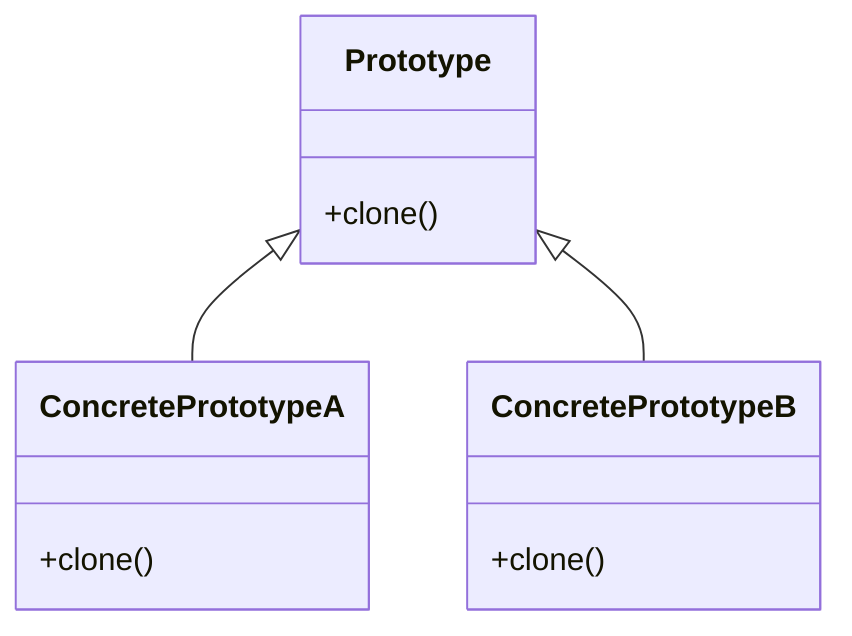

# 🧬 Patrón de Diseño: Prototype

## 📖 Descripción

El patrón **Prototype** es un patrón de diseño **creacional** que permite crear nuevos objetos **copiando** (clonando) una instancia ya existente, en lugar de instanciarlos desde cero con `new`.

Este patrón es especialmente útil cuando la creación de objetos es **costosa, compleja o repetitiva**, o cuando necesitas múltiples instancias muy similares.

## 🎯 Objetivo

> Evitar recrear estructuras complejas desde cero y proporcionar un mecanismo flexible para clonar objetos base con ligeras variaciones.

## 💡 Cuándo Usarlo en el Backend

- 🧾 **Generación de reportes**  
  Crear múltiples documentos o reportes con estructura común pero contenido variable (PDFs, HTML, correos).

- 📬 **Mensajes en colas/eventos**  
  Clonar mensajes base (`SQS`, `SNS`, `Kafka`) para múltiples tipos de eventos similares.

- ⚙️ **Configuraciones de microservicios**  
  Crear configuraciones similares por entorno, cliente o país.

- 🧪 **Configuraciones de pruebas**  
  Clonar configuraciones base de test y personalizar algunos valores por caso.

- 🔁 **Reintentos o duplicación de jobs**  
  Clonar tareas con leves ajustes para reintentos o versiones paralelas.

## ✅ Ventajas

| Ventaja              | Descripción |
|----------------------|-------------|
| ♻️ **Reutilización** | Puedes usar una plantilla o instancia ya preparada. |
| 🧠 **Simplicidad** | Reduce la complejidad al evitar construir desde cero. |
| 🧩 **Flexible** | Puedes clonar con variaciones mínimas según el contexto. |
| ⚡ **Rendimiento** | Evitas operaciones costosas de inicialización. |

## ⚠️ Consideraciones

❌ No lo uses si solo necesitas una o dos instancias simples con `new`.

✅ Úsalo si los objetos tienen estructuras complejas o son frecuentes.

💡 Es ideal si trabajas con DTOs, estructuras de mensajes, o configuraciones en arquitecturas basadas en eventos.

## 🧱 Estructura del Patrón

- **Prototype (Base)**: Objeto original con estructura completa.
- **Clonador**: Componente que realiza una copia profunda (`deep clone`) del objeto base.
- **Cliente**: Solicita clones con pequeñas modificaciones.

## 🧠 Alternativas y complementos

- Usa `structuredClone` (Node.js 18+) para clonar objetos.
- En NestJS puedes usar este patrón para clonar DTOs en middleware, pipes, y mensajes de eventos.

### ⚠️ Cosas que no se pueden clonar con structuredClone

    Funciones

    Instancias de clase personalizada

    Propiedades no enumerables o símbolos

    Referencias cíclicas (aunque sí las soporta si están bien estructuradas)

### 🧠 Útil en estos casos:

    Clonar objetos base (Prototype)

    Clonar req.body antes de sanitizarlo

    Trabajar con Web Workers, postMessage

    Reintentos de mensajes/eventos en colas